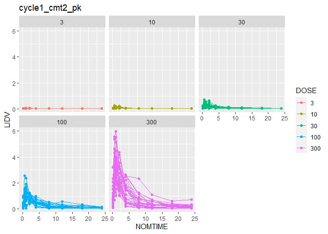
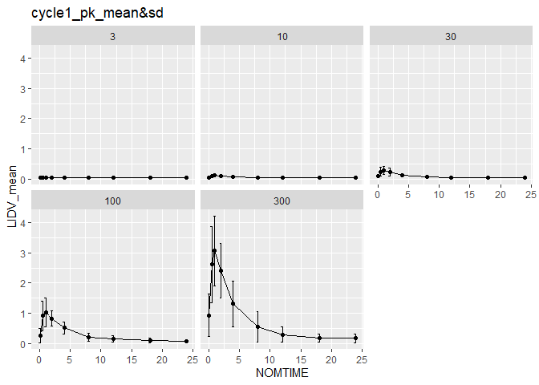

6.27 숙제 markdown
================
2023-06-30

# 숙제

## \## 6.27

Packages

``` r
library(tidyverse)
```

    ## ── Attaching core tidyverse packages ──────────────────────── tidyverse 2.0.0 ──
    ## ✔ dplyr     1.1.2     ✔ readr     2.1.4
    ## ✔ forcats   1.0.0     ✔ stringr   1.5.0
    ## ✔ ggplot2   3.4.2     ✔ tibble    3.2.1
    ## ✔ lubridate 1.9.2     ✔ tidyr     1.3.0
    ## ✔ purrr     1.0.1     
    ## ── Conflicts ────────────────────────────────────────── tidyverse_conflicts() ──
    ## ✖ dplyr::filter() masks stats::filter()
    ## ✖ dplyr::lag()    masks stats::lag()
    ## ℹ Use the conflicted package (<http://conflicted.r-lib.org/>) to force all conflicts to become errors

``` r
library(ggplot2)
library(NonCompart)
library (knitr)
```

Raw Data

``` r
data <-   read_csv("pkpd_dataset.csv", na= "NA")
```

    ## Rows: 20820 Columns: 21
    ## ── Column specification ────────────────────────────────────────────────────────
    ## Delimiter: ","
    ## chr  (4): TIMEUNIT, NAME, EVENTU, TRTACT
    ## dbl (17): ID, TIME, NOMTIME, AMT, LIDV, CMT, CENS, EVID, WEIGHTB, eff0, DOSE...
    ## 
    ## ℹ Use `spec()` to retrieve the full column specification for this data.
    ## ℹ Specify the column types or set `show_col_types = FALSE` to quiet this message.

### 1

Data

``` r
data_cycle_1 <- data |>
  filter(CMT == 2 & CYCLE == 1 & NAME == "PK Concentration") |>
  select(ID, NOMTIME, LIDV, DOSE) |>
  mutate(DOSE = as.factor(DOSE))
```

Plot: cycle1 cmt2 pk

``` r
data_cycle_1 |>
  ggplot(aes(x = NOMTIME, y = LIDV, color = DOSE, group = ID)) + geom_line() +
  geom_point() + facet_wrap(~DOSE) + labs(title = "cycle1_cmt2_pk")
```

<!-- -->

``` r
ggsave('cycle1_cmt2_pk.png')
```

    ## Saving 7 x 5 in image

### 2

Data

``` r
 data_mean_sd <- data |>
  filter(CYCLE == 1 & NAME == "PK Concentration") |>
  select(ID, NOMTIME, LIDV, NAME, DOSE) |>
  mutate(DOSE = as.numeric(DOSE))

data_mean_sd_1 <- data_mean_sd|>
  group_by(DOSE, NOMTIME) |>
   summarize(LIDV_mean = mean(LIDV),
             LIDV_sd = sd(LIDV)
            )
```

    ## `summarise()` has grouped output by 'DOSE'. You can override using the
    ## `.groups` argument.

plot : cycle1 mean, SD pk

``` r
data_mean_sd_1 |>
  ggplot(aes(x = NOMTIME, y = LIDV_mean)) + geom_line() + geom_point() +
  geom_errorbar(aes(ymin = LIDV_mean + LIDV_sd, ymax = LIDV_mean - LIDV_sd)) +
  facet_wrap(~DOSE) + labs(title = "cycle1_pk_mean&sd")
```

<!-- -->

``` r
ggsave('cycle1_pk_mean&sd.png')
```

    ## Saving 7 x 5 in image

### 3

Data

``` r
data_nca <- data |>
  filter(NAME == "PK Concentration" & !is.na(LIDV)) |>
  select(ID, NOMTIME, LIDV, DOSE, NAME)
```

NCA result

``` r
nca_result <- tblNCA(data_nca, key=c("ID", "DOSE"), colTime="NOMTIME", colConc="LIDV",timeUnit = "h", doseUnit="mg", concUnit="ng/mL")
```

CMAX mean, median, sd, min, max

``` r
nca_CMAX <-  nca_result |>
  select(ID, DOSE, CMAX) |>
  group_by(DOSE) |>
  summarize(CMAX_mean = mean(CMAX),
            CMAX_median = median(CMAX),
            CMAX_sd = sd(CMAX),
            CMAX_min = min(CMAX),
            CMAX_max = max(CMAX)
            )

knitr::kable(nca_CMAX)
```

| DOSE | CMAX_mean | CMAX_median |   CMAX_sd | CMAX_min | CMAX_max |
|-----:|----------:|------------:|----------:|---------:|---------:|
|    3 | 0.0578545 |    0.053217 | 0.0103824 | 0.050000 | 0.087176 |
|   10 | 0.1377452 |    0.130725 | 0.0454832 | 0.057579 | 0.255680 |
|   30 | 0.3837983 |    0.359505 | 0.1569786 | 0.169180 | 0.902380 |
|  100 | 1.4239993 |    1.399200 | 0.3964846 | 0.709010 | 2.546200 |
|  300 | 3.9945233 |    3.921650 | 1.2116568 | 2.231300 | 6.996000 |
